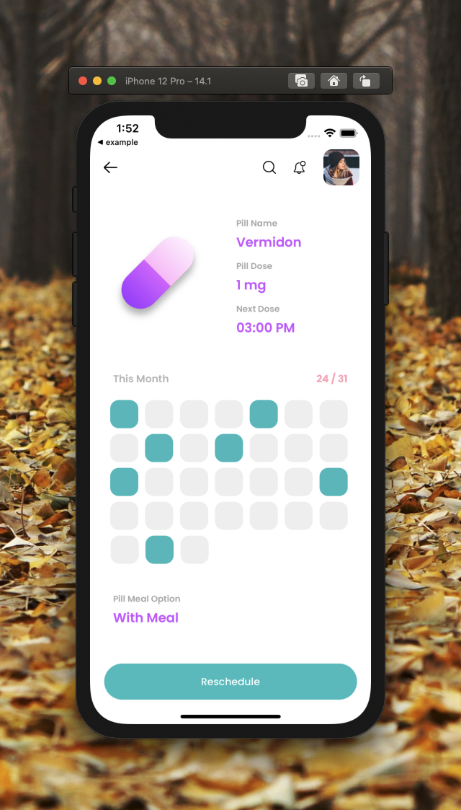

[](https://github.com/WrathChaos/react-native-monthly)

[](https://www.npmjs.com/package/react-native-monthly)
[](https://www.npmjs.com/package/react-native-monthly)

[](https://opensource.org/licenses/MIT)
[](https://github.com/prettier/prettier)

<table>
 <tr>
    <td align="center"> 
  
    </td>
    <td align="center">
  
    </td>
   </tr>
</table>

# Installation

Add the dependency:

```bash
npm i react-native-monthly
```

## Peer Dependencies

<h5><i>IMPORTANT! You need install them</i></h5>

```js
"@freakycoder/react-native-bounceable": ">= 0.2.4",
```

# Usage

## Import

```jsx
import RNMonthly from "react-native-monthly";
```

## Fundamental Usage

```jsx
<RNMonthly numberOfDays={31} activeDays={[1, 5, 6, 11, 21, 31]} />
```

```jsx
<RNMonthly
  numberOfDays={30}
  activeBackgroundColor="green"
  inactiveBackgroundColor="#E6FFDE"
  activeDays={[1, 5, 6, 11, 21, 31]}
/>
```

```jsx
<RNMonthly
  numberOfDays={28}
  activeBackgroundColor="#9C1818"
  inactiveBackgroundColor="#FFDEDE"
  activeDays={[1, 5, 6, 11, 21, 31]}
/>
```

## Example Project 😍

You can checkout the example project 🥰

Simply run

- `npm i`
- `react-native run-ios/android`

should work of the example project.

# Configuration - Props

## Fundamentals

| Property     |   Type    |  Default  | Description                                                         |
| ------------ | :-------: | :-------: | ------------------------------------------------------------------- |
| numberOfDays |  number   |    31     | change days of the month it should be more than 28 and less than 31 |
| activeDays   | number[]  | undefined | set the active days                                                 |
| style        | ViewStyle |  default  | set or override the style object for the main container             |

## Customization (Optionals)

| Property                |   Type   |  Default  | Description                                                        |
| ----------------------- | :------: | :-------: | ------------------------------------------------------------------ |
| activeBackgroundColor   |  color   | "#49c1c2" | change the active background color                                 |
| inactiveBackgroundColor |  color   | "#f0f0f0" | change the inactive background color                               |
| onPress                 | function | undefined | set your own logic for the button functionality when it is pressed |

## Future Plans

- [x] ~~LICENSE~~
- [ ] Today Feature
- [ ] Write an article about the lib on Medium

## Credits

Insipired on [Martyna Zielińska](https://dribbble.com/shots/6556907-Medicine-Reminder)

## Author

FreakyCoder, kurayogun@gmail.com

## License

React Native Monthly is available under the MIT license. See the LICENSE file for more info.
